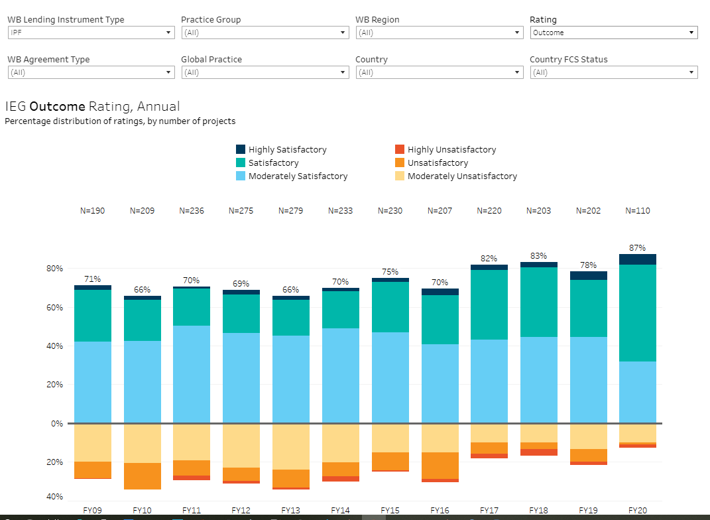
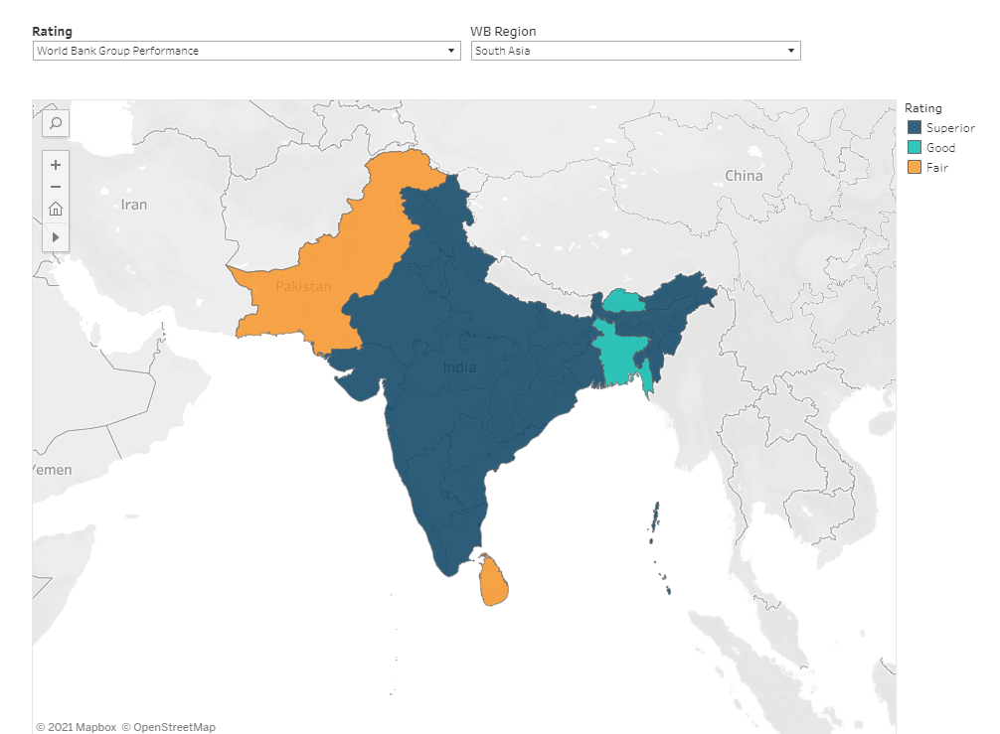
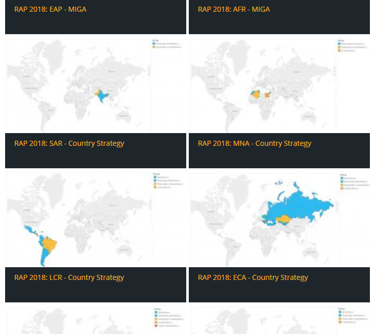
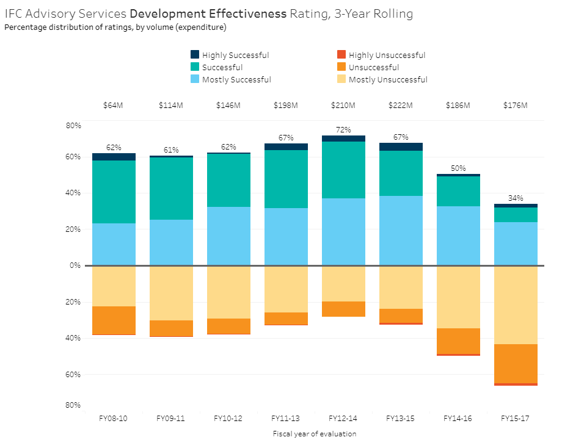
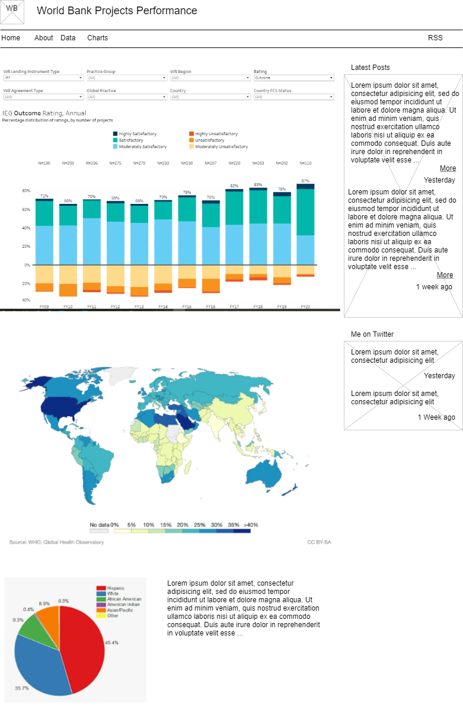

# Proposal For Project 2 - UCF Data Analytics and Visualization Bootcamp 

Data Bootcamp Project2 : Analysis of the World Bank Project Performance Ratings

This document contains our proposal for project 2.  We will produce data visualizations based on the
project assessments carried out by the Independent Evaluation Group (IEG), an independent unit that
evaluated the performance of projects financed by the World Bank.  Spanning over 30 years, the collection has more than 11,300 project assessments, covering more than 9,600 completed projects; it is perhaps the longest-running and most comprehensive project performance data collection of its kind.

# Data Story
Why are some World Bank project more successefull than others?
Our work tells the story of the success rate of projects financed by the World Bank Organization, and explore several datasets to try to find why some are successful and others are not. We will compare the success rate of projects from data from the [IEG WB Project Ratings](https://data.world/finance/ieg-wb-project-ratings) with other data sets, for example the [Worldwide GDP data](https://ourworldindata.org/grapher/gdp-per-capita-worldbank), and see if we discover trends in the data that might explain the projects' success rates.  We will also upload and analyze data from [world population data set](https://ourworldindata.org/search?q=world+population+by+country) and the [world corruption index](https://www.transparency.org/en/cpi/2020/index/nzl), and correlate it with the projects' performance data.  

The data is contained in a CSV file, at [IEG_World_Bank_Project_Performance_Ratings.csv]( https://data.world/finance/ieg-wb-project-ratings/file/IEG_World_Bank_Project_Performance_Ratings.csv)

## Team Members (Group #2)  
* Phillip Ogborn
* Alciluz Gomez
* Jose Robles

## Project Proposal

### Sample Visualizations:

---

# Sketch of the final design

# [Link to the primary GitHub repository](https://github.com/DataBootcamp-Project2-WorldBank/project2)
