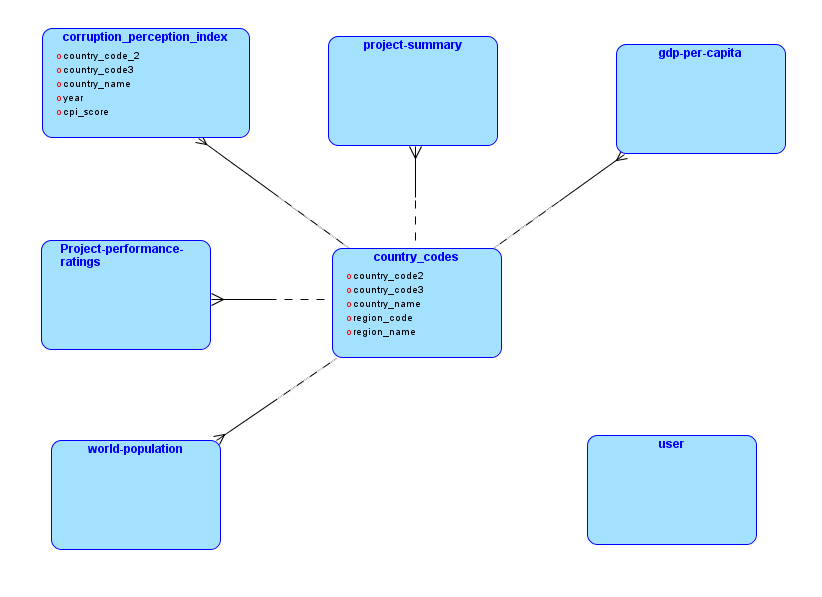
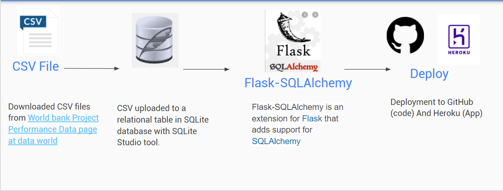
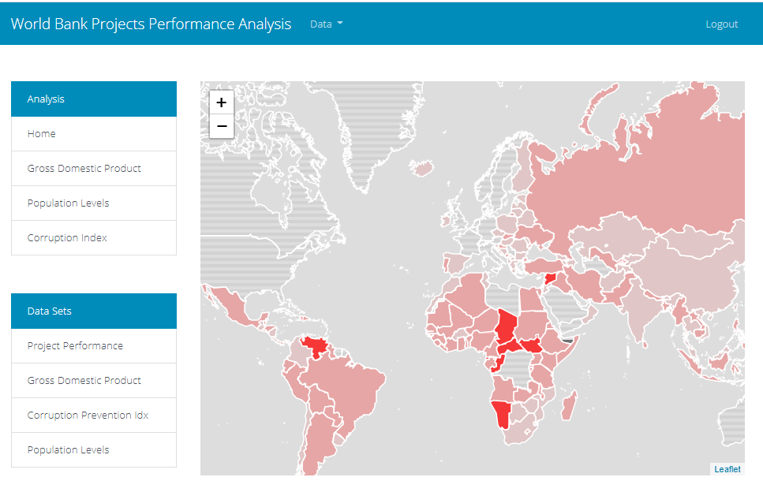
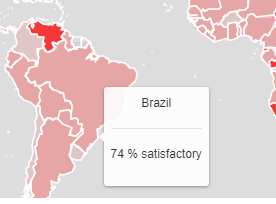

# Project 2 - UCF Data Analytics and Visualization Bootcamp 
# Analysis of the World Bank Project Performance Ratings

In this project, we produced data visualizations based on the
project assessments carried out by the Independent Evaluation Group (IEG), an independent unit that
evaluated the performance of projects financed by the World Bank.  Spanning over 30 years, the collection has more than 11,300 project assessments, covering more than 9,600 completed projects; it is perhaps the longest-running and most comprehensive project performance data collection of its kind.

You can find the Proposal document for the project [here.](https://github.com/DataBootcamp-Project2-WorldBank/project2/blob/main/Proposal.md)

Download the [PDF document](project2_presentation.pdf) with the slides for the presentation given during class.

# Data Story

The World Bank is an international financial institution that provides loans and grants to the governments of low- and middle-income countries for the purpose of pursuing capital projects.  Their most recently stated goal is the reduction of poverty.

### Why are some World Bank project more successeful than others?

Our work tells the story of the success rate of projects financed by the World Bank Organization, and explore several datasets to try to find why some are successful and others are not. We compared the success rate of projects from data from the [IEG WB Project Ratings](https://data.world/finance/ieg-wb-project-ratings) with other data sets, for example the [Worldwide GDP data](https://ourworldindata.org/grapher/gdp-per-capita-worldbank),  looking for factors that might explain the projects' success rates.  We also uploaded and analyzed data from [world population data set](https://ourworldindata.org/search?q=world+population+by+country) and the [world corruption index](https://www.transparency.org/en/cpi/2020/index/nzl), and correlated it with the projects' performance data.  

We produced three visualizations that can help predict if a particular project will be successful, and made them accessible in a web application created with the [Flask](https://www.fullstackpython.com/flask.html) framework. 

The data is contained in a CSV file, at [IEG_World_Bank_Project_Performance_Ratings.csv]( https://data.world/finance/ieg-wb-project-ratings/file/IEG_World_Bank_Project_Performance_Ratings.csv)

## Data Sources
|What                                      |Source            |Description                                                                                 |Size|
|------------------------------------------|------------------|--------------------------------------------------------------------------------------------|-----|
|World Bank Projects Performance           |Data.World        |Contains the ratings by the IEG for World Bankpr ojects since 1973.                         |4.1Mb|
|World Gross Domestic Product Indexes      |Data.World        |Contains the values for GDP for all countries from 2010 to 2019                             |.237Mb|
|Corruption Perception Index               |Kaggle            |Contains ratings on Corruption Prevention for all countries as reported by Transparency.org.|7.3Mb|
|World Population Levels                   |ourworldindata.org|World Population Figures                                                                    |1.2Mb|
|GeoJson Formatted Data for World Countries|Datahub.io        |Contains the GeoJson data used to draw the countries as features on a map.                  |23Mb|

## Libraries, Frameworks Used
|Front-End                                                              |Middle Tier                                                    |Database                  |
|-----------------------------------------------------------------------|---------------------------------------------------------------|--------------------------|
|HTML, Javascript, CSS, Bootswatch (themes), Leaflet.js, D3.js, Plot.ly |Python,  Flask-SQLAlchemy, IPython (Jupiter Notebooks), Pandas |SQL, SQLite, Postgres     | 

## Entity (Tables) Design

**corruption_perception_index**  : Contains the CPI Score for each country and year since 2010 to 2015.

**dgp_per_capita**  : Contains the GDP figures for each country since 1990 until 2017

**country_codes**  : Contains the ISO country codes and names.

**project_performance_ratings** : Fact table with the project evaluation ratings for each country since 1948 until 2015.

**world-population** : Contains world population figures since the year 1800 until 2019.

**user** : Contains the list of application users.

## ETL Process

## Fron-End Application (User's Guide)
The application has been deployed to Heroku cloud. Follow this [link](https://alciluz-jose-phillip-project2.herokuapp.com/) to acccess it.
A sample, unpriviledged user has been created as username = rouser, password=readonly.
After logging in the landing page will be shown:

The map shows those countries (in different shaded colors) where World Bank Projects have been evaluated by the IEG.  

  Hovering over the country in the map will show the ToolTip with the country name and the percentage of satisfactory outcomes for the projects implemented at that country:
(TODO: Finish User Guide section)

---